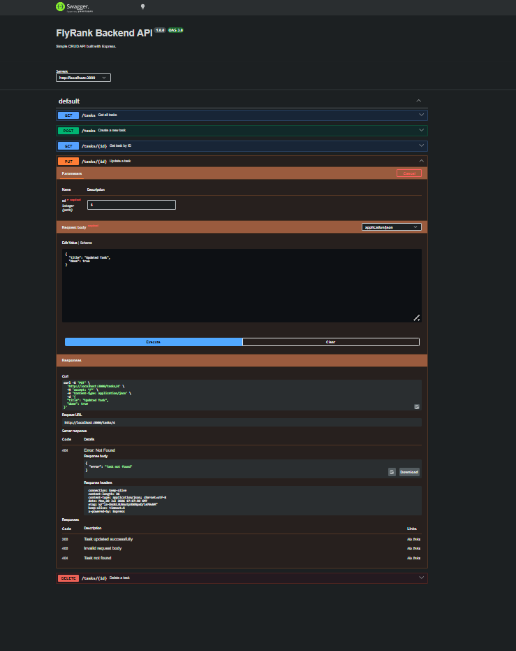

# FlyRank Backend API

## What This Is

FlyRank Backend API is a REST API built with Node.js and Express.js for managing tasks.

The project provides complete CRUD operations:
- Create tasks
- Read tasks
- Update tasks
- Delete tasks

It also includes API documentation using Swagger UI.

---

## Installation & Running

Clone the repository:

```bash
git clone https://github.com/ShizaAhsan/flyrank-backend.git
```

Install dependencies:

```bash
npm install
```

Run the server:

```bash
node server.js
```

The API will be available at:

```
http://localhost:3000
```

Swagger documentation:

```
http://localhost:3000/docs
```

---

## API Endpoints

| Method | Endpoint | Description |
|--------|----------|-------------|
| GET | `/` | API information |
| GET | `/health` | Health check |
| GET | `/tasks` | Get all tasks |
| GET | `/tasks/:id` | Get task by ID |
| POST | `/tasks` | Create a new task |
| PUT | `/tasks/:id` | Update a task |
| DELETE | `/tasks/:id` | Delete a task |

---

## Curl Test Output

Example:

```bash
curl -i http://localhost:3000/tasks
```

Response:

```http
HTTP/1.1 200 OK
Content-Type: application/json

[
  {
    "id": 1,
    "title": "Learn Backend",
    "done": false
  }
]
```

---

## Swagger UI Screenshot

Swagger UI documentation




# AI vs Me

## My Prompt

Create a REST API using Node.js and Express.js.

Requirements:

- Use Express.js framework.
- Store tasks in memory using an array.
- Do not use any database.

Create these CRUD endpoints:

- GET /
- GET /health
- GET /tasks
- GET /tasks/:id
- POST /tasks
- PUT /tasks/:id
- DELETE /tasks/:id

POST /tasks should validate:
- title is required.
- done must be a boolean value.

Use proper HTTP status codes:
- 200 for successful requests.
- 201 for successfully created resources.
- 400 for invalid input.
- 404 when a resource is not found.

All responses should be returned in JSON format.

Add Swagger UI documentation using OpenAPI specification.

Provide complete runnable code.


---

# Comparison: AI vs Me

## What did AI do better?

The AI generated code faster and provided a cleaner project structure. It also added better comments and organized Swagger documentation clearly. Since I built the API manually in previous stages, I was able to understand and review the AI-generated implementation.


## What did AI get wrong or ignore?

1. The AI initially returned status code 200 for creating tasks instead of 201, which was required for POST /tasks.

2. The AI missed or handled validation differently for the `done` field and allowed invalid values.

3. The AI made some assumptions about the project structure and documentation style that were not specifically mentioned in my prompt.


## What did my prompt forget to specify?

My prompt did not specify the exact task object structure, error message format, or whether PUT should support partial updates. The AI made its own decisions for these parts.


## Rematch

After improving my prompt by adding more details about validation, response formats, and project structure, the AI generated a more accurate version of the API.